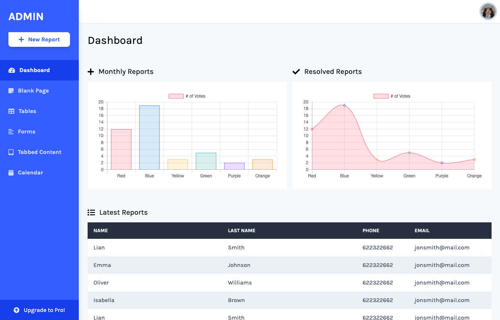

# Tailwind Admin Template

This is an admin dashboard template buit with [Tailwind](https://tailwindcss.com/) and [Alpine.js](https://github.com/alpinejs/alpine). This is inspired by the dribbble shots of [Vishnu Prasad](https://dribbble.com/shots/11085023-Medical-Dashboard) and [Filip Justić](https://dribbble.com/shots/10965359-Workly-My-Tasks-List).

View the demo [here](https://davidgrzyb.github.io/tailwind-admin-template/) 😎

 <section className="bg-main z-30 ">
      

        <h2 className="mb-4 text-xl font-bold text-gray-900">
          Add a new product
        </h2>
        <form action="#">
          

            

              <label className="block mb-2 text-sm font-medium text-gray-900">
                Product Name
              </label>
              <input
                type="text"
                name="name"
                id="name"
                className="bg-gray-50 border border-gray-300 text-gray-900 text-sm rounded-lg focus:ring-primary-600 focus:border-primary-600 block w-full p-2.5    "
                placeholder="Type product name"
                required=""
              />
            

            

              <label className="block mb-2 text-sm font-medium text-gray-900">
                Brand
              </label>
              <input
                type="text"
                name="brand"
                id="brand"
                className="bg-gray-50 border border-gray-300 text-gray-900 text-sm rounded-lg focus:ring-primary-600 focus:border-primary-600 block w-full p-2.5    "
                placeholder="Product brand"
                required=""
              />
            

            

              <label className="block mb-2 text-sm font-medium text-gray-900">
                Price
              </label>
              <input
                type="number"
                name="price"
                id="price"
                className="bg-gray-50 border border-gray-300 text-gray-900 text-sm rounded-lg focus:ring-primary-600 focus:border-primary-600 block w-full p-2.5    "
                placeholder="$2999"
                required=""
              />
            

            

              <label className="block mb-2 text-sm font-medium text-gray-900">
                Category
              </label>
              <select
                id="category"
                className="bg-gray-50 border border-gray-300 text-gray-900 text-sm rounded-lg focus:ring-primary-500 focus:border-primary-500 block w-full p-2.5    "
              >
                <option selected="">Select category</option>
                <option value="TV">TV/Monitors</option>
                <option value="PC">PC</option>
                <option value="GA">Gaming/Console</option>
                <option value="PH">Phones</option>
              </select>
            

            

              <label className="block mb-2 text-sm font-medium text-gray-900">
                Item Weight (kg)
              </label>
              <input
                type="number"
                name="item-weight"
                id="item-weight"
                className="bg-gray-50 border border-gray-300 text-gray-900 text-sm rounded-lg focus:ring-primary-600 focus:border-primary-600 block w-full p-2.5    "
                placeholder="12"
                required=""
              />
            

            

              <label className="block mb-2 text-sm font-medium text-gray-900">
                Description
              </label>
              <textarea
                id="description"
                rows="8"
                className="block p-2.5 w-full text-sm text-gray-900 bg-gray-50 rounded-lg border border-gray-300 focus:ring-primary-500 focus:border-primary-500    "
                placeholder="Your description here"
              ></textarea>
            

          

          <button
            type="submit"
            className="inline-flex items-center px-5 py-2.5 mt-4 sm:mt-6 text-sm font-medium text-center text-white bg-primary-700 rounded-lg focus:ring-4 focus:ring-primary-200 dark:focus:ring-primary-900 hover:bg-primary-800"
          >
            Add product
          </button>
        </form>
      

    </section>